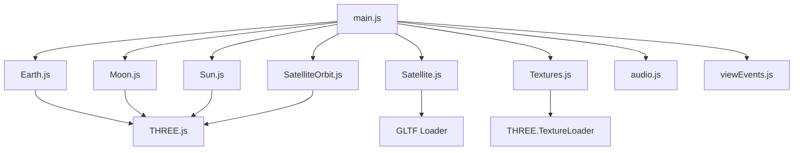

# GalaxiX - Scientific Calculations Project

## Project Overview

GalaxiX is a 3D visualization project that simulates celestial bodies including Earth, Moon, Sun, and a satellite in orbit. The project uses Three.js for 3D rendering and includes realistic textures, animations, and audio effects to create an immersive space environment.

## Project Structure

```
Scientific-Calculations-Project/
├── index.html                 # Main HTML entry point
├── package.json               # Project dependencies
├── public/                    # Static assets
│   ├── audios/                # Background audio files
│   │   └── space.mp3          # Space ambient sound
│   ├── models/                # 3D models
│   │   └── satellite/         # Satellite GLTF model
│   ├── satellite-favicon.png  # Website favicon
│   ├── sounds/                # Sound effects
│   │   └── hit.mp3            # Collision sound effect
│   └── textures/              # Texture images
│       └── planets/           # Planet textures
└── src/                       # Source code
    ├── js/                    # JavaScript modules
    │   ├── Satellite.js       # Satellite class
    │   ├── SatelliteOrbit.js  # Satellite orbit visualization
    │   ├── Textures.js        # Texture loading utilities
    │   ├── audio.js           # Audio setup and management
    │   └── viewEvents.js      # View and event handlers
    ├── main.js                # Main application entry point
    ├── planets/               # Celestial body classes
    │   ├── Earth.js           # Earth implementation
    │   ├── Moon.js            # Moon implementation
    │   └── Sun.js             # Sun implementation
    └── style.css              # Application styles
```

## Component Relationships



## Core Components

### Main Application (main.js)

The central orchestrator that initializes the 3D scene, camera, renderer, and all celestial objects. It also handles animation loops and window resize events.

### Celestial Bodies

#### Earth (Earth.js)

- Creates a realistic Earth with day/night textures
- Implements cloud layer with transparency
- Adds atmospheric glow using custom shaders
- Handles Earth rotation animation

#### Moon (Moon.js)

- Implements the Moon with realistic texture
- Handles orbital movement around Earth

#### Sun (Sun.js)

- Creates the Sun with appropriate texture
- Implements light emission

### Satellite System

#### Satellite (Satellite.js)

- Loads and positions the satellite 3D model
- Handles satellite movement in orbit
- Implements satellite orientation to face Earth

#### SatelliteOrbit (SatelliteOrbit.js)

- Creates a visual representation of the satellite's orbit path
- Implements toggle visibility for orbit visualization

### Support Modules

#### Textures (Textures.js)

- Centralizes texture loading for all celestial bodies
- Configures texture properties (anisotropy, color space, etc.)

#### Audio (audio.js)

- Manages background space ambient sound
- Implements audio controls through GUI

#### ViewEvents (viewEvents.js)

- Handles user interaction events
- Manages camera positioning and controls

## Technologies Used

- **Three.js**: Core 3D rendering library
- **lil-gui**: Debug UI for controlling scene parameters
- **GLTFLoader**: For loading 3D models
- **OrbitControls**: Camera control system

## Scientific Calculations

The project implements various scientific calculations including:

1. **Orbital Mechanics**: Satellite and Moon orbits follow mathematical models
2. **Rotational Dynamics**: Earth rotation with proper axial tilt (23.5°)
3. **Atmospheric Effects**: Shader-based atmospheric scattering simulation
4. **Lighting Physics**: Directional lighting from the Sun with proper shadows

## User Interface

The application provides a debug UI (using lil-gui) that allows users to:

- Toggle satellite orbit visualization
- Control audio settings
- Adjust other scene parameters

The main view uses OrbitControls to allow users to freely navigate the 3D space.

## Future Enhancements

Potential areas for expansion:

1. Additional celestial bodies (other planets, asteroids)
2. More complex orbital calculations (gravitational effects)
3. Spacecraft trajectory planning tools
4. Time controls for speeding up/slowing down simulation
5. Educational overlays explaining astronomical concepts
