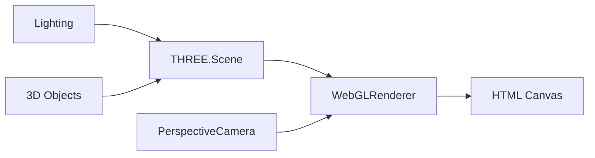
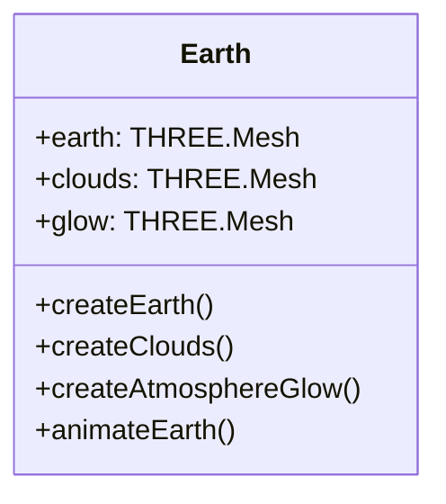
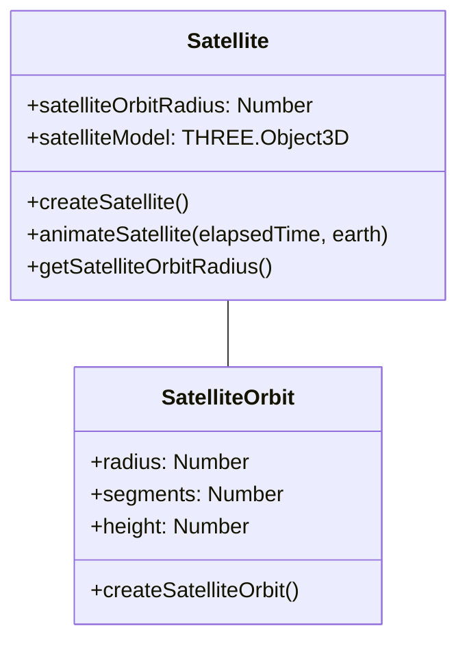

# GalaxiX - Technical Documentation

## Code Implementation Details

### Rendering Pipeline

The project uses Three.js's WebGL renderer with the following configuration:

- PerspectiveCamera with 75° field of view
- Antialiasing enabled for smoother edges
- Physically correct lighting model
- Shadow mapping for realistic shadows



## Class Architecture

### Earth Class

The Earth implementation uses multiple layers to create a realistic appearance:



- **Base Earth**: Uses day/night textures with normal mapping
- **Cloud Layer**: Semi-transparent cloud texture overlay
- **Atmosphere**: Custom shader-based glow effect

### Satellite System



## Animation System

The project uses requestAnimationFrame for smooth animations with the following calculations:

- **Time-based Animation**: Uses elapsed time to ensure consistent motion regardless of frame rate
- **Orbital Calculations**: Uses trigonometric functions to calculate positions
  ```javascript
  // Example from Satellite.js
  const satAngle = -elapsedTime;
  const x = Math.cos(satAngle) * this.satelliteOrbitRadius;
  const z = Math.sin(satAngle) * this.satelliteOrbitRadius;
  ```

## Texture Management

Textures are centrally managed in the Textures.js module:

- Earth textures include day map, night map, normal map, and cloud textures
- Optimization techniques include:
  - Anisotropic filtering (value: 8)
  - Proper color space configuration (SRGBColorSpace)
  - Texture wrapping for seamless display

## Performance Considerations

- **Geometry Optimization**: Appropriate polygon counts for different objects
- **Shader Complexity**: Custom shaders for atmospheric effects balanced for performance
- **Asset Loading**: Asynchronous loading of 3D models and textures

## Mathematical Models

### Orbital Mechanics

The satellite and moon orbits use parametric equations to calculate positions:

- **Circular Orbit**: `x = r * cos(θ)`, `z = r * sin(θ)`
- **Orbital Period**: Controlled by animation speed

### Atmospheric Scattering

The Earth's atmosphere uses a custom Fresnel-based shader that calculates rim lighting effects:

```glsl
// Simplified version of the vertex shader
void main() {
    vec3 vNormal = normalize(normalMatrix * normal);
    vec3 vNormel = normalize(normalMatrix * viewVector);
    intensity = pow(c - dot(vNormal, vNormel), p);
    // ...
}
```

## Development Workflow

### Project Setup

The project uses Vite as a build tool with the following configuration:

- ES modules for clean dependency management
- Hot module replacement for fast development
- Optimized production builds

### Asset Pipeline

- 3D models are stored in GLTF format for efficient loading
- Textures are stored as JPEG files with appropriate resolution for performance
- Audio files are compressed MP3 format

## Browser Compatibility

The application is designed to work on modern browsers that support:

- WebGL 2.0
- ES6+ JavaScript features
- Web Audio API

## Debugging Tools

The project includes debugging capabilities through lil-gui:

- Toggle visibility of satellite orbit
- Audio controls
- Performance monitoring

## Code Organization Principles

- **Modularity**: Each celestial body and major function has its own module
- **Object-Oriented Design**: Classes for reusable components
- **Separation of Concerns**: Rendering, physics, and UI are separated
